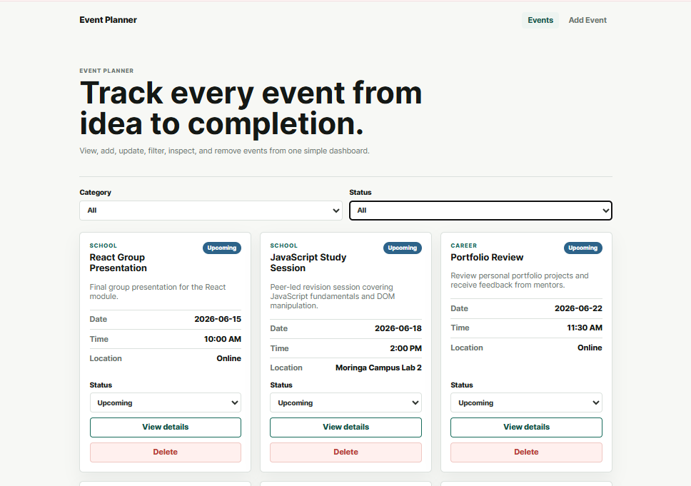

# Event Planner App

## Description
Event Planner is a Single Page Application (SPA) built with React that allows users to create and manage upcoming events. Users can view all events displayed as cards, add new events through a form, view full event details, update event status, delete events and filter events by category or status without reloading the page.

## Screenshot

## Features
- View all events displayed as cards on the home page
- Add a new event using a form with full details
- View full event details on a dedicated details page
- Update event status — Upcoming, Ongoing, Completed or Cancelled
- Delete an event from the list
- Filter events by category or status
- Loading, error and empty state messages for better user experience
- Responsive design for mobile and desktop screens
- No page reload when navigating between pages

## How to Run the Project
1. Clone the repository
2. Navigate into the project folder
3. Run npm install to install dependencies
4. Run npm install -g json-server@0.17.4 to install JSON Server
5. Start JSON Server in a separate terminal with json-server --watch db.json --port 3001
6. Start the React app with npm run dev
7. Open your browser and go to http://localhost:5173

## Technologies Used
- React
- React Router DOM
- Vite
- JSON Server
- CSS3
- Fetch API

## Future Implementations
- Add search functionality to find events by title
- Add ability to edit full event details
- Add user authentication
- Add event reminders and notifications

## Collaborators
- [Abigail Tandiwe](https://github.com/tandisimelane-15) — Project Lead, Forms and State Management
- [Tracy Wafula](https://github.com/TracyWafula) — UI and Design Lead
- [Brian Kiprotich](https://github.com/Kibrioh) — Routing and API Lead
- [Zakaria Hassan](https://github.com/zackzack-hash) — Components Lead

## How to Contribute
Pull requests are welcome. For major changes please open an issue first.

## License
MIT License
Copyright (c) 2026 Abigail Tandiwe

Permission is hereby granted, free of charge, to any person obtaining a copy of this software and associated documentation files (the "Software"), to deal in the Software without restriction, including without limitation the rights to use, copy, modify, merge, publish, distribute, sublicense, and/or sell copies of the Software, and to permit persons to whom the Software is furnished to do so, subject to the following conditions:

The above copyright notice and this permission notice shall be included in all copies or substantial portions of the Software.

THE SOFTWARE IS PROVIDED "AS IS", WITHOUT WARRANTY OF ANY KIND, EXPRESS OR IMPLIED, INCLUDING BUT NOT LIMITED TO THE WARRANTIES OF MERCHANTABILITY, FITNESS FOR A PARTICULAR PURPOSE AND NONINFRINGEMENT. IN NO EVENT SHALL THE AUTHORS OR COPYRIGHT HOLDERS BE LIABLE FOR ANY CLAIM, DAMAGES OR OTHER LIABILITY, WHETHER IN AN ACTION OF CONTRACT, TORT OR OTHERWISE, ARISING FROM, OUT OF OR IN CONNECTION WITH THE SOFTWARE OR THE USE OR OTHER DEALINGS IN THE SOFTWARE.

## Contact
- LinkedIn: [Abigail Tandiwe](https://www.linkedin.com/in/abigailtandi)
- Email: tandisimelane24@gmail.com